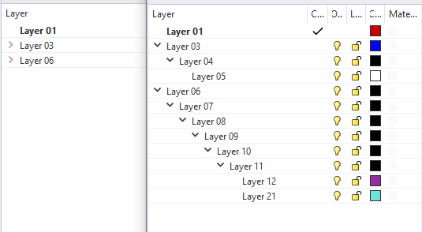

# Expand_All_Layer  

ライノのレイヤーを展開するコマンド >>> `ExpandLayer`  

  

レイヤーの数が多く階層が深いファイルで、全体を把握し表示非表示を整理するためにとりあえず全部展開したい。  
レイヤーパネル >> Tools >> Expand All で同じことができるが、マウス操作ででしかアクセスできず怠い。（なんかそれっぽいショートカットも一応あるようです）  

最上位の親を畳めばそれ以下は隠せるので逆はとりあえず要らない想定。  

これ以外にもほぼ同じ仕組みで、すべてのレイヤーのロック外すコマンドと、すべてのレイヤーを表示するコマンドを作成足したが、特に後者で重いファイルを処理すると非常に重くなり死ぬので封印。。。  

## Install  

インストールは下記よりインストーラか、自分でコンパイルしてください。  

インストーラ  
[https://github.com/naysok/Expand_All_Layer/releases/](https://github.com/naysok/Expand_All_Layer/releases/)  

ソース  
[https://github.com/naysok/Expand_All_Layer/blob/main/ExpandLayer_cmd.py](https://github.com/naysok/Expand_All_Layer/blob/main/ExpandLayer_cmd.py)  

## Ref  

- rs.LayerIds()  
    - [https://developer.rhino3d.com/api/RhinoScriptSyntax/#layer-LayerIds](https://developer.rhino3d.com/api/RhinoScriptSyntax/#layer-LayerIds)  

- rs.IsLayerExpanded()  
    - [https://developer.rhino3d.com/api/RhinoScriptSyntax/#layer-IsLayerExpanded](https://developer.rhino3d.com/api/RhinoScriptSyntax/#layer-IsLayerExpanded)   

- rs.ExpandLayer()  
    - [https://developer.rhino3d.com/api/RhinoScriptSyntax/#layer-ExpandLayer](https://developer.rhino3d.com/api/RhinoScriptSyntax/#layer-ExpandLayer)  
